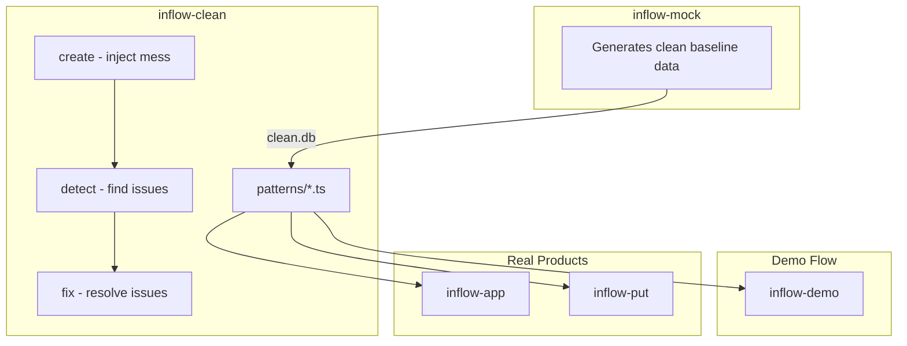

# inflow-tools

Meta repository for the inflow-tools ecosystem. This repo contains documentation, roadmaps, and project governance—not code.

## What This Repo Is

- Project-wide architecture docs
- Roadmap and planning
- RFCs for design decisions
- Issue templates for cross-cutting concerns

## Related Repositories

### Core Stack (MIT - Public)

| Repo | Purpose |
|------|---------|
| `inflow-client` | API client with auth & rate limiting |
| `inflow-api-types` | Zod schemas for API validation |
| `inflow-get` | Sync Inflow → SQLite |
| `inflow-materialize` | Materialized views on synced data |
| `inflow-mock` | Generates clean baseline mock data |
| `inflow-clean` | Data quality patterns: create, detect, fix |
| `inflow-demo` | Shows inflow-clean in action (sales funnel) |
| `inflow-app` | Next.js frontend for Inflow data |
| `inflow-put` | Write adapter (planned) |

### GTM Stack (Private)

| Repo | Purpose |
|------|---------|
| `inflow-demographics` | ICP research, audience identification |
| `inflow-marketing` | Outreach campaigns, email templates |
| `inflow-tunnel` | Landing pages, credibility/bio, lead capture |

## Key Concepts

### Materialization-Centric Architecture
Views are the contract layer. Frontends and PUT services are dumb adapters that read/write view-shaped data. Business logic lives in view definitions.

### Credibility-First Conversion
Open source core stack proves expertise. Tunnel shows bio, LinkedIn, public repos BEFORE asking for credentials.

### The Funnel
Demographics (find) → Marketing (reach) → Tunnel (trust) → Dashboard (prove) → Services (close)

### inflow-mock + inflow-clean: The Engine



**The symmetry insight:** If you can `create()` a type of mess, you can `detect()` and `fix()` it. Same patterns work on generated DB AND real client data.

| Repo | Output | Purpose |
|------|--------|---------|
| `inflow-mock` | clean.db | Baseline test data |
| `inflow-clean` | patterns/*.ts | Create/detect/fix data issues |
| `inflow-demo` | UI | Show the cleanup story (sales funnel) |

Prospects see their mess detected by inspectable open source code. Trust → conversion.

### Services Offered
- Data cleanup & PUT
- Consulting
- Custom tools
- Team training

## Working in This Repo

- **Updating docs**: Edit markdown files in `docs/`
- **New features**: Create RFC from `rfcs/000-template.md`
- **Diagrams**: Use Mermaid in markdown (GitHub renders it)
- **Cross-repo issues**: Create here, link to implementation repos

## File Structure

```
docs/
  architecture.md   # System design, data flow diagrams
  ecosystem.md      # Business model, go-to-market
rfcs/
  000-template.md   # Copy this for new proposals
ROADMAP.md          # What's done, what's next
```

## MCP Tools

This repo has `.mcp.json` configured with:
- `inflow-repos` - Lists all ldraney/inflow-* repos with description, visibility, URL, and last push date. Use for ecosystem oversight, tracking stale repos, or updating ROADMAP.md.

## When Editing

- Keep docs concise and scannable
- Use Mermaid for diagrams (not external images)
- Update ROADMAP.md when package status changes
- Link to specific repos for implementation details
