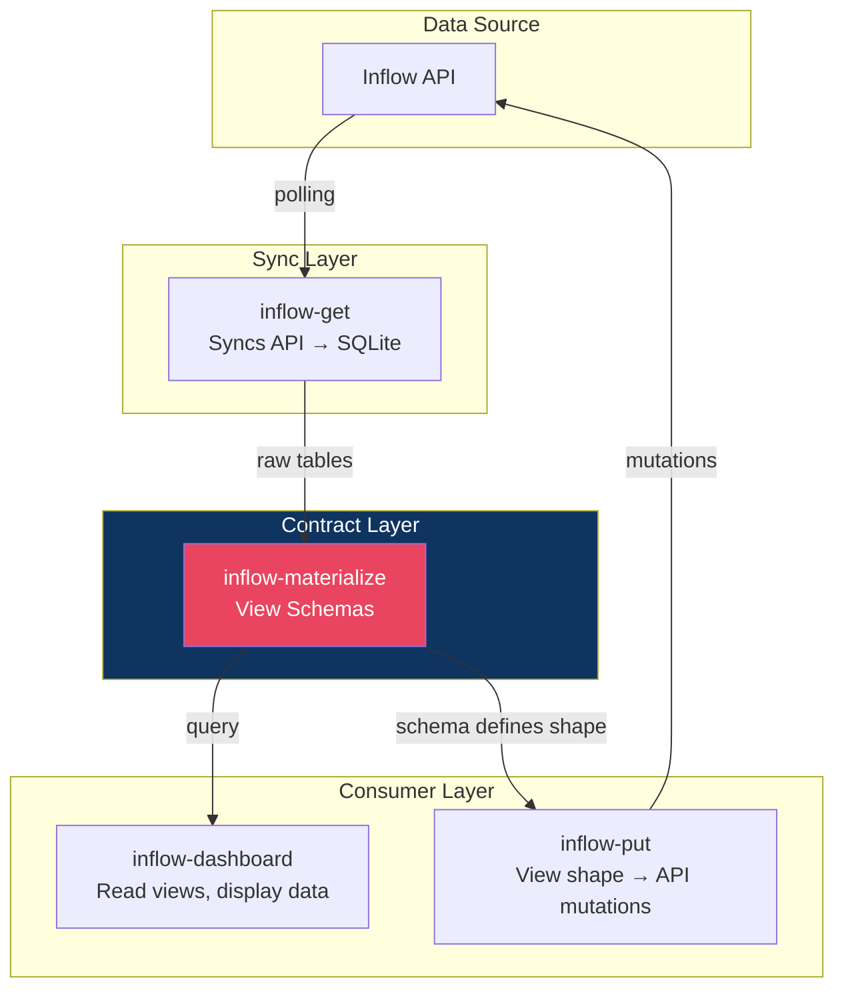
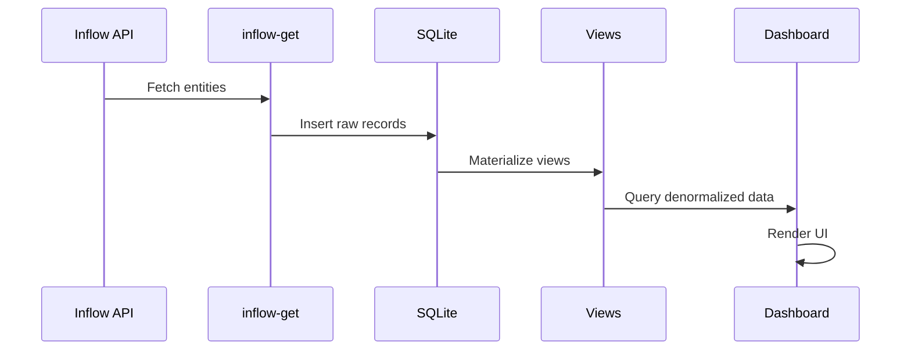
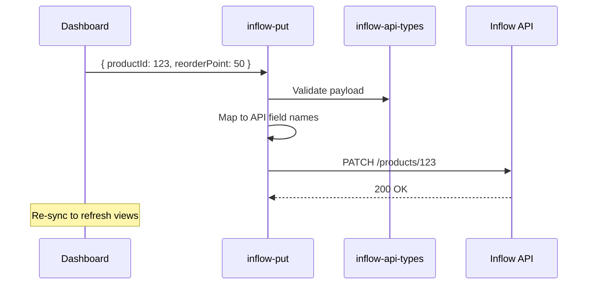

# Architecture

## Core Insight

**Materialized views are the contract layer** between data sources and consumers.

Views define the business domain shape. Everything else is plumbing:
- Frontends read view-shaped data
- PUT services accept view-shaped updates and map to API calls
- Business logic lives in view definitions, not scattered across apps

## System Overview

## Package Responsibilities

### inflow-client
- HTTP communication with Inflow API
- Authentication handling
- Rate limit management
- Retry logic

### inflow-api-types
- Zod schemas for all API entities
- Request/response validation
- TypeScript types derived from schemas

### inflow-get
- Orchestrates full sync from Inflow → SQLite
- Handles pagination
- Stores raw entities in normalized tables
- Produces `.db` file as artifact

### inflow-materialize
- Creates SQL views on top of raw tables
- Joins related entities
- Computes derived fields (reorder status, etc.)
- Defines the **business domain contract**

### inflow-dashboard
- NextJS frontend
- Reads materialized views
- Displays inventory status, alerts, reports
- No business logic—pure display

### inflow-put
- Accepts view-shaped update payloads
- Maps fields to Inflow API endpoints
- Validates against inflow-api-types
- Executes mutations

## Data Flow

### Read Path

### Write Path

## Why This Architecture?

| Concern | Traditional | View-Centric |
|---------|-------------|--------------|
| Business logic | Scattered across frontends | Centralized in view definitions |
| Adding a frontend | Reimplement joins/calculations | Query existing views |
| Changing calculation | Update every consumer | Update one view |
| Write service complexity | Knows business rules | Just field mapping |

## Artifact Strategy

Each sync produces:
- `inflow.db` - SQLite database with raw tables + views
- `*.csv` exports - Flat files of each view for non-technical users

These can be attached to GitHub releases for versioned snapshots.
